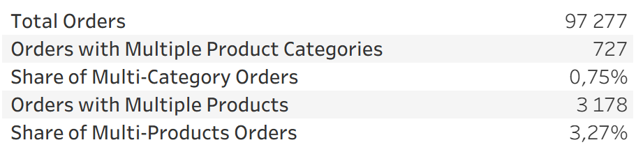
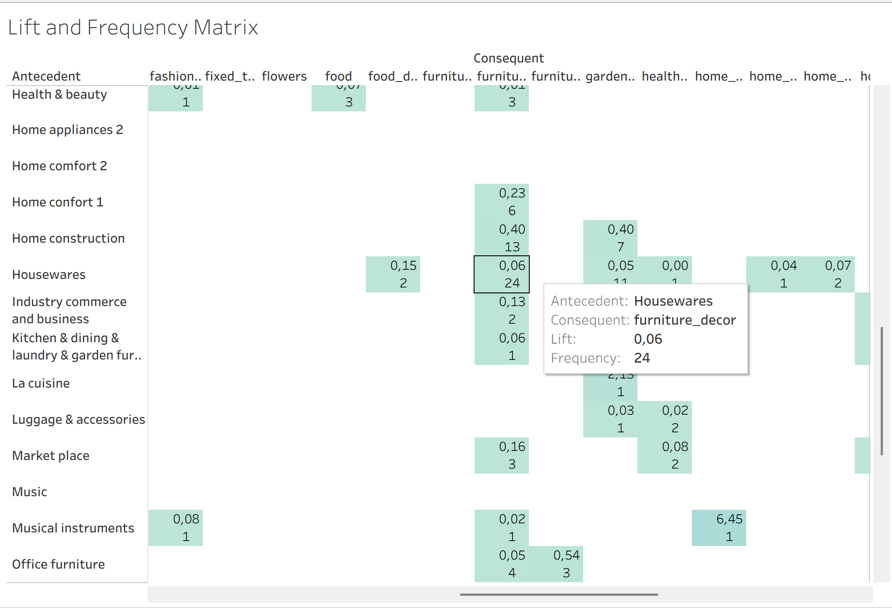
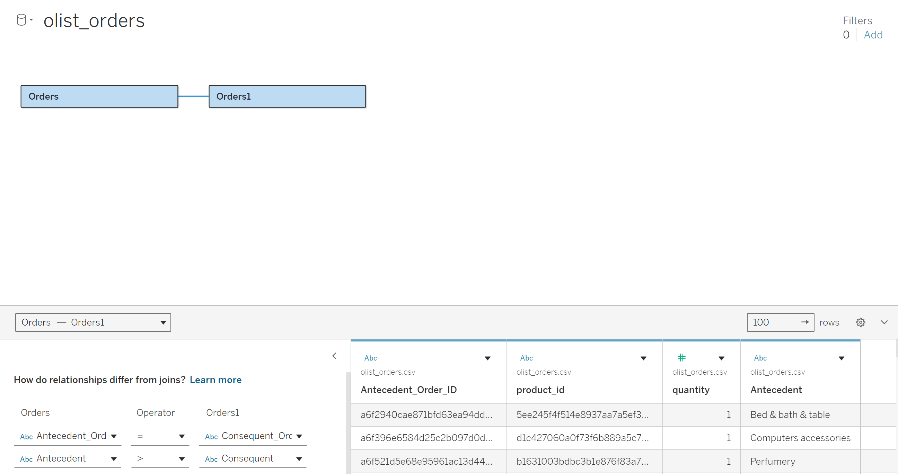
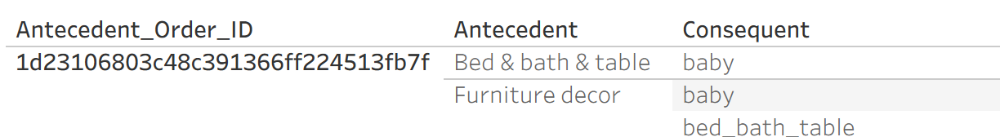

# E-Commerce-Data-Preparation-Insights
Data preparation on real-world Brazilian ecommerce public dataset  made for category-level Masrket Basket Analysis

## Repository Structure
- `data_preparation.ipynb` — main Python file
- `data/raw/` — original CSVs (unmodified)
- `data/processed/` — final CSV for Tableau
- `MBA_Olist.twbx` — Tableau packaged workbook

## Data
Source: [Brazilian E-Commerce Public Dataset by Olist.](https://www.kaggle.com/datasets/olistbr/brazilian-ecommerce/data)

Orders made at [Olist store](https://www.olist.com/) (Brazil) in 2016 to 2018. Collection methodology: Random Sampling.

## Overview 
This project began as an attempt to perform Market Basket Analysis (MBA) on a large, real-world e-commerce dataset at the category level. The full data preparation workflow was completed — including cleaning, merging, and translating product categories — before a key insight emerged:
>Less than 1% of orders contained products from more than one category.

This finding made traditional category-level MBA impractical due to sparse co-occurrences and unstable metrics. Still, the work provides valuable insights and methodological lessons.In this dataset, the extreme rarity of multi-category orders meant that association metrics like support, confidence, and lift would be unstable and largely uninformative.

## Outcome

While the dataset was not suitable for category-level MBA, the work is still valuable for:

- **Data preparation process** — joining multiple datasets, handling missing values, and translating categories from Portuguese to English.
- **Exploratory findings** — orders are overwhelmingly single-category → sparse co-occurrences.  MBA metrics (lift/confidence) are unstable for most pairs due to low support.
- **Lessons learned** — to check basic dataset characteristics relevant to the intended analysis before committing to main actions.
- **Tableau problem-solving** - implementing MBA logic in Tableau required building a self-join on the orders table to generate antecedent–consequent pairs. This was a challenging but valuable learning step, since Tableau does not natively support MBA. The screenshots included show how the self-join was configured.
  
  

## Key Metrics 
Market Basket Analysis relies on a few standard metrics to detect meaningful co-occurrence and evaluate the strength of associations between items: 

- **Frequency** – the raw count of how many times an item (or item pair) occurs in the dataset. 
- **Support** – the proportion of all transactions that include a given item or item pair.
 `Support(A ⇒ B) = (Transactions containing A and B) / (Total Transactions)`
- **Confidence** – the conditional probability that a transaction containing item A also contains item B.
 `Confidence(A ⇒ B) = (Transactions containing A and B) / (Transactions containing A​)`
- **Lift** – a measure of how much more likely items A and B occur together than if they were independent.
  `Lift(A ⇒ B) = Support(A → B) ÷ (Support(A) × Support(B))`.
Lift > 1 indicates a positive association (complementary products). Lift < 1 indicates a negative association (substitudes). Lift = 1: Product A and Product B are randomly ordered together.

Together, these metrics highlight not just how often items co-occur, but whether their co-occurrence is stronger than chance.

## Possible actions 
- Aggregate categories into broader groups to increase support.
- Olist full product-level MBA (instead of category-level) — more pairs, but will be still sparse.
- Investigate data collection bias — it’s possible the dataset reflects a preference for single-product or single-category orders (e.g., promotional setup, platform-specific ordering habits).

## Next Step
I’ve also completed a more fruitful MBA project using a dataset with richer, multi-item baskets.  This project remains published here as an example of data preparation and exploratory analysis for real-world datasets.
